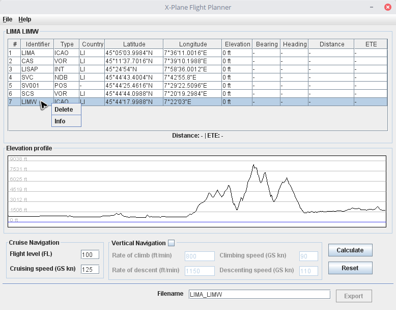
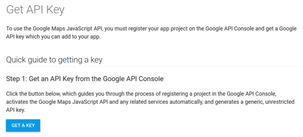
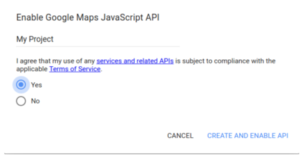
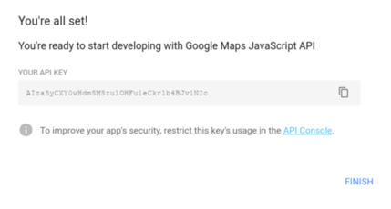
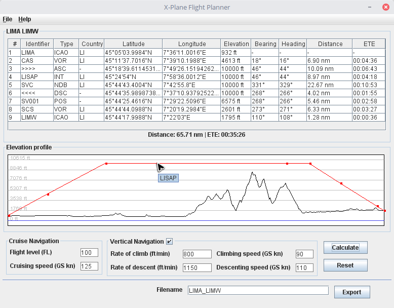
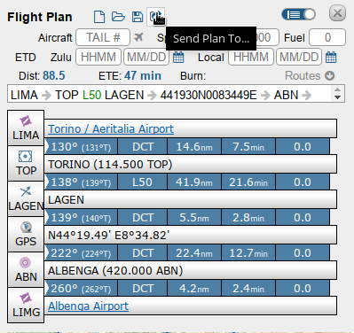
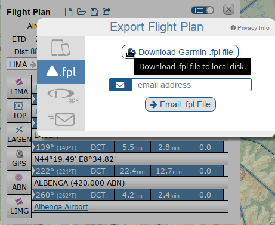
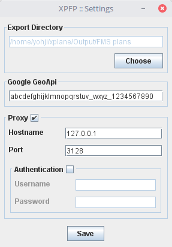

# X-Plane Flight Planner

**XPFP** is *Free-and-Open-Source* desktop software for flight planning mainly intends for *X-Plane*. It only requires *Java* at version >= 1.7.

## Features

* Handling *FPL* and *FMS* file format.
* Flight plan calculation with course, elevation, distance and *ETE*.
* Vertical navigation calculation.
* Ascent and descent waypoint calculation.
* Elevation profile graph for avoiding obstacles.
* Exporting in *FMS* file format.

## Future Features

* Map graph using *OpenStreetMap*.
* Integration with *Navigraph*.
* Handling *GPX*, *KML* and *GML* file format.

**IT IS ONLY FOR FLIGHT SIMULATION! DO NOT USE IT FOR REAL FLIGHT!**

### Google API Key

You can obtain a key for using the Google services at this link: [Google API Key](https://developers.google.com/maps/documentation/javascript/get-api-key). It is mandatory for **XPFP**; it must be supplied into [Settings](#settings). You just need for a valid Google account: everything is for free. Maybe this procedure can be a bit annoying, but it is the only way to release **XPFP** for free.

### Flight plan

You have to import a file of the supported format to load a flight plan. The table shows every waypoint of the plan. You can interact with a waypoint by right-clicking over it. You have to supply flight data information for the calculation. Ascent and descent waypoint are calculated if Vertical navigation is enabled. You can export the plan in the *X-Plane .fms* file format by click on Export, only if a calculation is been completed with success.

### SkyVector

You can use [SkyVector](https://skyvector.com/) to plan the flight over the map, using available navigational aid. You can export the plan in the *Garmin .fpl* file format and import it into **XPFP**.

### Settings

#### Export Directory

Select the directory where every files will be exported. You can set the *X-Plane* Output FMS plans folder;

#### Google API

Insert the *Google* API key as explained in the [Google API Key](#google-api-key) section.

#### Proxy

Setup the web proxy, if it is required, by enabling the *Active* flag and providing *Hostname* and the *Port*. Flag the *Authentication* if it is required and provide *Username* and *Password*.
